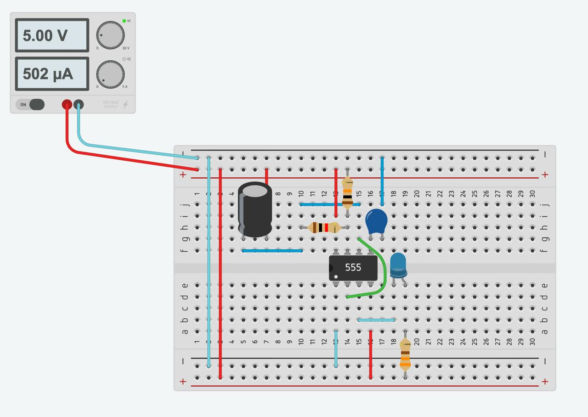

# Reporte de Práctica 1: Temporizador 555 en Modo Astable
**Institución:** Universidad Iberoamericana Puebla  
**Materia:** Introducción a la Mecatrónica  
**Tema:** Electrónica 101: Temporizador 55  

### Lista de materiales 
 1. (1x) Protoboard
 2. (1x) NE555
 3. (1x) LED 
 4. (1x) Resistor para LED de 330Ω 
 5. Resistores temporizadores:
    - RA=1kΩ
    - RB=10kΩ
 6. (1x) Capacitor electrolítico: 100µF 
 7. (1x) Capacitor cerámico: 10nF
 8. Cables de conexión (jumpers)
 9. (1x) Puntas de fuente.
 10. (1x) Puntas de osciloscopio 
 
### *Simulación*

### Fórmulas
 En modo astable, el capacitor ***C*** se carga desde la fuente de alimentación a través de ***RA +RB***. Cuando alcanza 2/3 de ***Vcc***, el 555 activa un circuito de descarga donde ***C***, se descarga através de ***RB*** hasta llegar a 1/3 de ***Vcc***. Este proceso se repite continuamente y, por ello, el LED permanece parpadeando.  
 El tiempo que le lleva al capacitor cargarse y descargarse, determina la frecuencia con la que el LED parpadea. Esos tiempos se calculan con las siguientes fórmulas:  

 **Tiempo de carga:**

$$
t_{alto}=0.693(R_A+R_B)C
$$

**Tiempo de descarga:**

$$
t_{bajo}=0.693(R_B)C
$$

**Período:**

$$
T=t_{alto}+t_{bajo}
$$

**Frecuencia:**

$$
f=\frac{1}{T}=\frac{1.44}{(R_A+2R_B)C}
$$

**Duty:**

$$
D=\frac{t_{alto}}{T}\times100\%=\frac{R_A+R_B}{R_A+2R_B}\times100\%
$$

### Tabla Comparativa 
| Magnitud | Teórico | Medido | % de error | Inst. de medición |
| --- | --- | --- | --- | --- | 
| Vcc (V) | 5.0 | 5.37 | 7.4% | Multímetro |
|V de salida en Alto (V) | 3.5 | 4.4V | 25.7% | Multímetro |
| Frecuencia  (Hz) | 0.69 | 5.37hz | 678% | Osciloscopio |
| Duty (%) | 52.4% | 55.18% |  5.30% | Osciloscopio |
| I del LED (mA) | 1.52mA | 1.47mA | 3.29% | Multímetro | 

Para conocer el porcetaje de error se utiliza la siguiente formula:
$$
x=5
$$

### Explicación de diferencias  
- **Vcc** → Obtuvimos un porcentaje de error de 7.4%. Esto puede deberse a que la fuente de alimentación no proporciona exactamente el valor nominal de 5V. La diferencia es pequeña, por lo que el valor se encuentra cerca de lo esperado.  
- **V de salida en alto** → Porcentaje de error de 25.7%. Esto se debe a las características internas del 555 y a la carga conectada a la salida, que serian el LED y su resistencia. Además, hay que tener en cuenta que nuestro Vcc fue un poco más alto, lo cual tambien influye en el voltaje de salida.  
- **Frecuencia** → Tenemos un porcentaje de 678%, el cual es muy alto. Esta diferencia se debe a que el valor teórico se realizó con valores de resistencias y capacitores diferentes a los que utilizamos. Al calcular el valor teórico con las medidas de nuestros componentes, obtuvimos un resultado de 6.26Hz, que se encuentra más cerca de los 5.37Hz que medimos. La diferencia aquí se debe a la tolerancia de los componentes y a las condiciones de medición.    
- **Duty cycle** → Porcentaje de error de 5.30%. Es una diferencia pequeña y puede ser por las variaciones de los valores de las resistencias y del capacitor, además de las condiciones de medición del osciloscopio.  
- **I del LED** → Obtuvimos un error de 3.29%. Esta diferencia se debe principalmente a la tolerancia de la resistencia utilizada en el LED, la cual puede tener un valor un poco diferente al que utilizamos. Además, el multímetro puede tener cierta variación al medir.