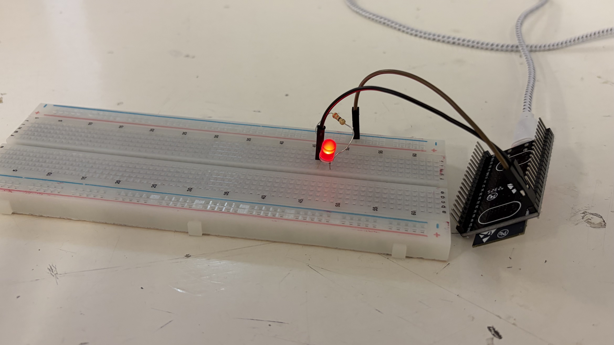
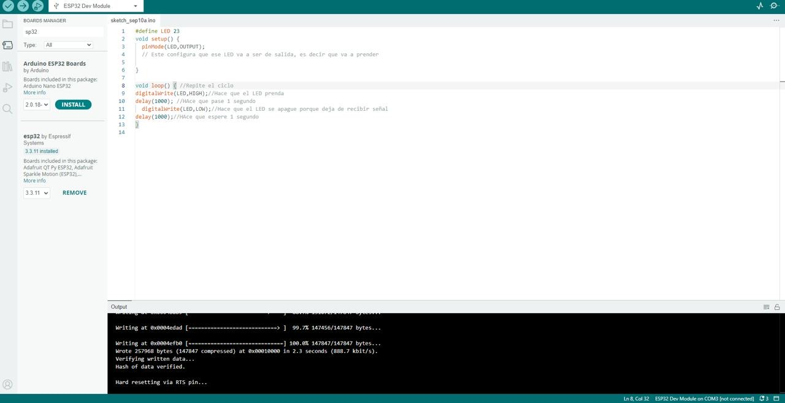
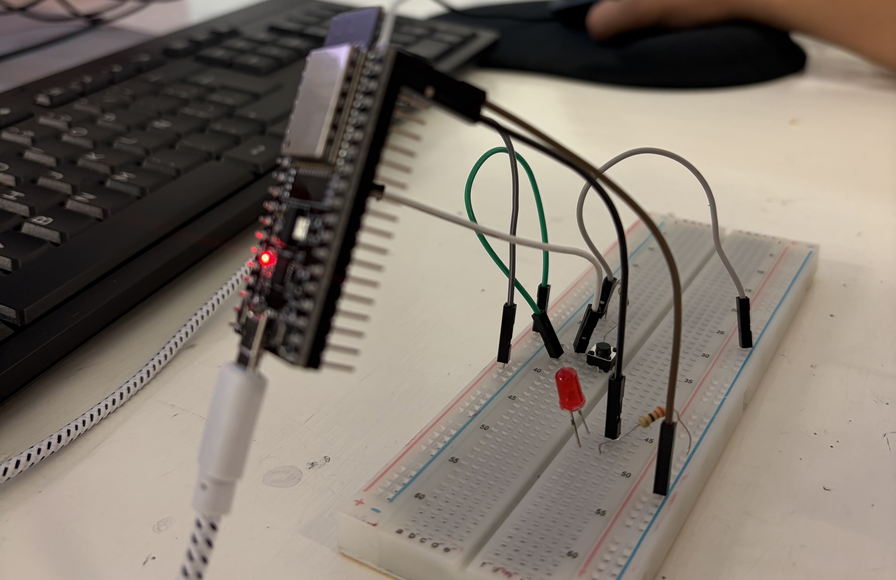
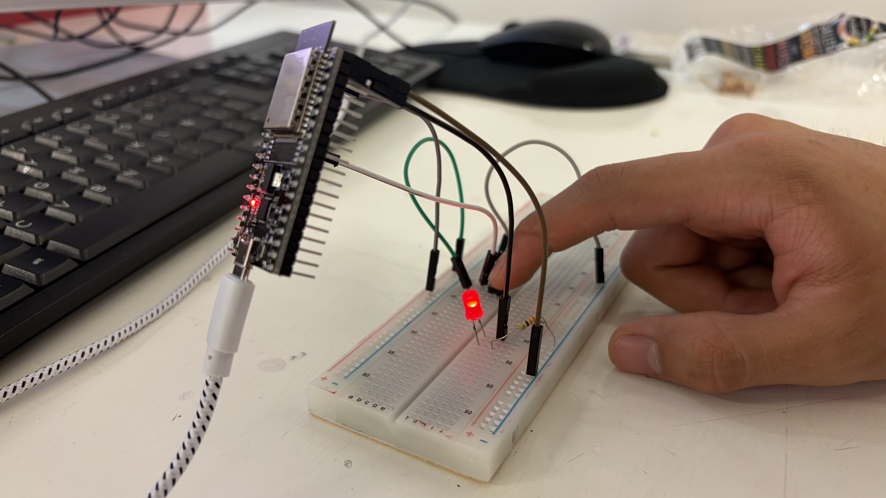
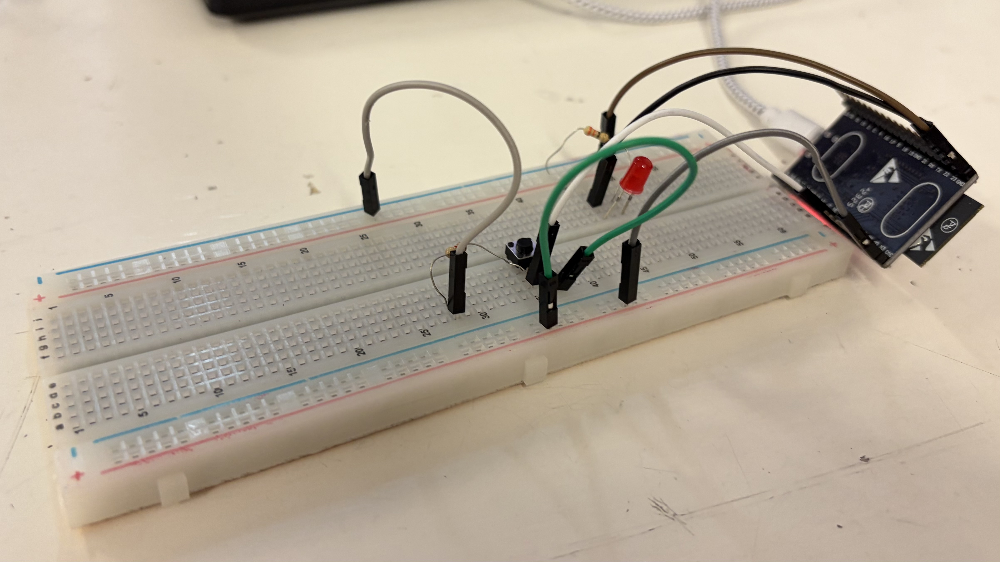
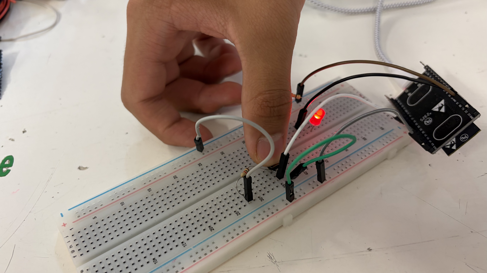
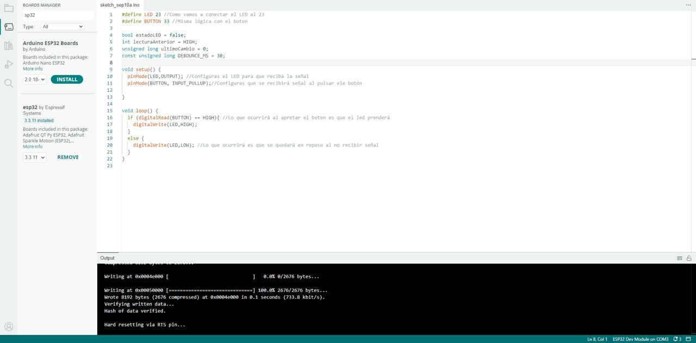

# Reporte de Práctica 2: MCU 101:ESP32  
**Institución:** Universidad Iberoamericana Puebla  
**Materia:** Introducción a la Mecatrónica  
**Tema: ESP32:** Salida, Entrada y Antirrebote    

### Materiales
- (1×) ESP32 DevKit V1 (WROOM-32) 
- (1×) Cable USB de datos 
- (1×) LED 
- (1×) resistor 220 Ω 
- (1×) Push button 
- (1×) Resistor 10 kΩ (opcional) 
- Protoboard y jumpers
 
### ¿Qué es el rebote de un botón?  
El rebote de un boton es un fenomeno que ocurre cuando mantienes presionado un botón y lo sueltas. Digamos que tu estas ejerciendo una fuerza contra el botón para activarlo y al soltarlo se “deja caer” contra la parte de la placa superior y esto genera diminutas microseñales que pueden activar por milisegundos el mecanismo. Pensemoslo diferente, digamos que dejas caer un objeto al suelo y este objeto no va a simplemente caer y quedarse en el suelo, lo que ocurrirá es que se elevara nuevamente y volvera a caer hasta quedar compleamente estáticas.  
### ¿Por qué con INPUT_PULLUP la lógica queda invertida?  
Porque al estar en reposo el botón el circuito se encuentra prendido, es decir, cuando esta normal es prendido o de otra forma HIGH, mientras que al apretar el boton la corriente se desvía hacia el  GND y se apaga el LED o en otras palabras LOW.  

### Reporte de fallas
1. **¿Qué falló?:** Inicialmente tuvimos problemas para programar la placa ESP32 debido a que no nos aparecía la placa en nuestras computadoras personales y el código no quedaba bien, a la hora de compilarlo nos marcaba un error debido a que omitiamos la parte de escribir ;
2. **¿Cómo lo encontramos?:** Tuvimos que leer multiples veces el código y borrarlo.
3. **¿Cómo lo resolviste?:** Volvimos a escribir el código 3 veces hasta comprenderlo  

### Ensamble
**Blink**

  
**Blink con botón**

**Toogle con antirrebote**

