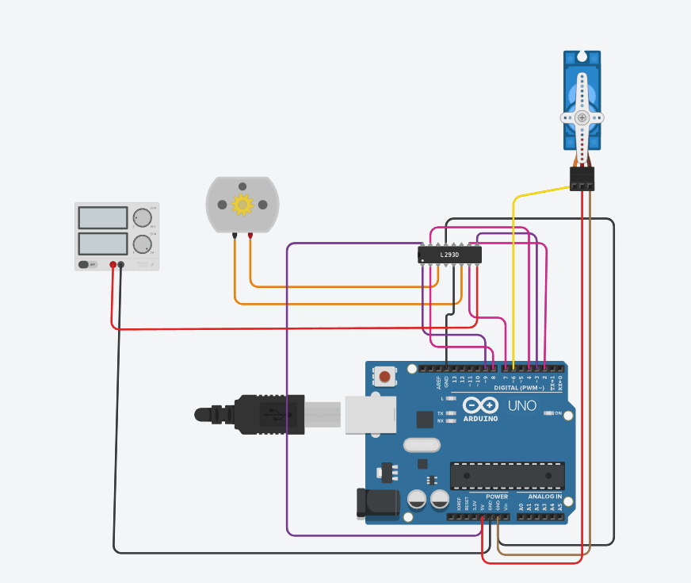
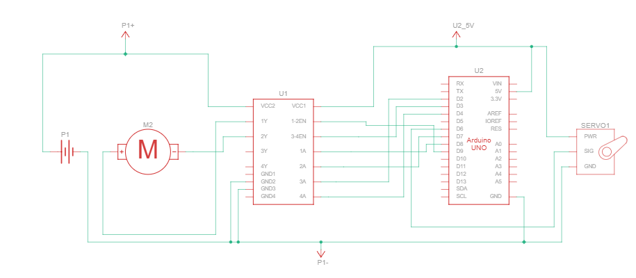
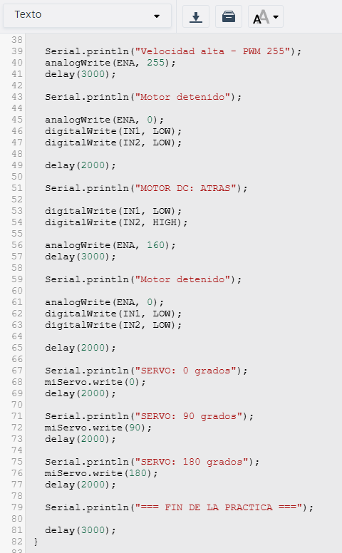
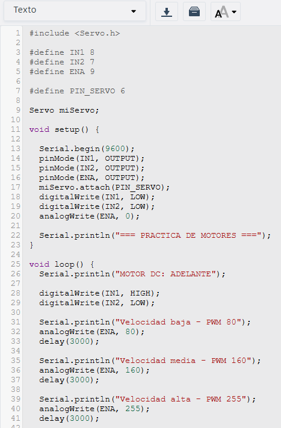

### Reporte de práctica 3: Actuadores 101
**Institución:** Universidad Iberoamericana Puebla  
**Materia:** Introducción a la Mecatrónica  
**Tema:** Actuadores 101:  Motor DC, Puente H y PWM.

### Lista de materiales 
 1. Arduino
 2. Motor CC
 3. Servomotor
 4. LS23D
 5. Fuente de energía
 6. Jumpers 

### *Simulación*

### *Esquemático*

### *Código*

### Explicación

## Bitácora de errores
