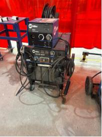
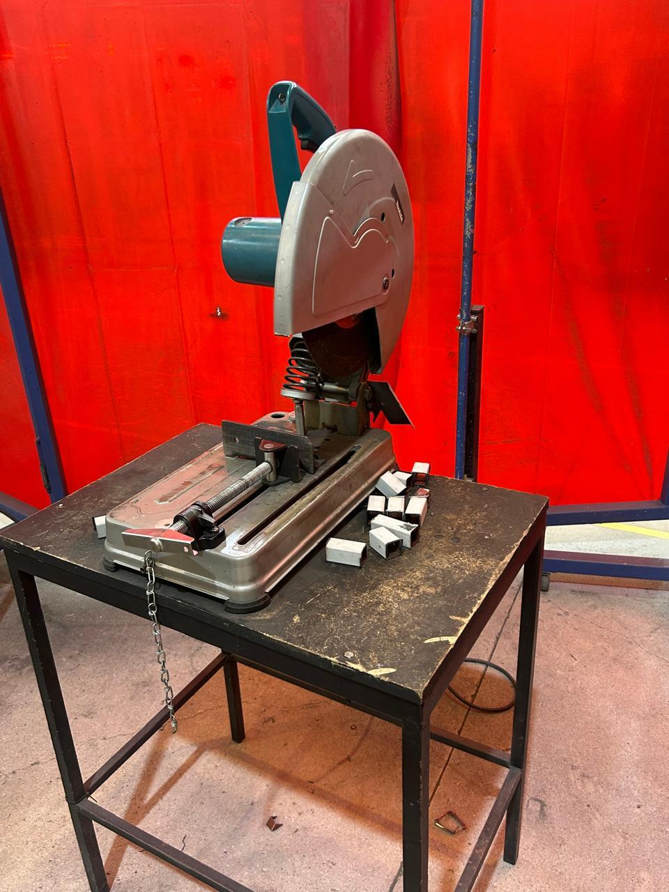

# Reporte de Clase 2 de Jesús Emiliano
**Institución:** Universidad Iberoamericana de Puebla
**Tema:**Cortadora de Disco y Soldadura

### 1.- Introducción de la Clase 2
En esta sesión el maestro Oliver y Cholula nos enseñaron a cortar con cortadora de disco y el funcionamiento de las máquinas de soldar.

### 2.- Medidas de seguridad
Antes de comenzar a utilizar las máquinas debimos cumplir con ciertas medidas para garantizar nuestra seguridad, previamente nuestro profesor nos solicitó llevar bata de laboratorio o un overol y unas botas con casquillo. Sumado a eso la universidad no proporcionó guantes, pechera, lentes de seguridad y careta para soldar para poder mantener segura nuestra vista en caso de soldar y nuestras extremidades de cualquier material pesado que pueda rebotar o caerse.

### 3.- Funcionamiento de la Maquina de Soldar
La primera máquina utilizada fue la de soldar, era una Miller y el profesor Cholula nos explicó como utilizarla:
1.- Conexión de la máquina: Primero la máquina se conectó a un enchufe especial que administra una mayor corriente
2.- Conexión con la mesa: La máquina cuenta con dos pinzas, una de tierra la cual se conecta con la mesa metálica sobre la cual se va a trabajar y la otra conocida coo porta electrodo la cuál va a sostener la varilla que se fundirá en el material que se busca soldar. (Es importante entender que el sistema funciona como un circuito el cual al cerrarse funde la varilla).
3.- Ajustar el Voltaje y la corriente: Es necesario ajustar las cantidades necesarias según la acción a realizar, el grosor del material y la experiencia del soldador; un voltaje alto puede ocasionar perforaciones en la pieza a trabajar y uno muy bajo que la varilla no se funda correctamente y se una mal al material o se pegue.
4.- Confirmar medidas de seguridad: Si estas acompañado antes de iniciar el procedimiento comprueba que las personas a tu alrededor tengan careta puesta debido a que podrías causar un daño en su vista. No olvides que debes usar guantes aislantes en toda ocasión y mantener una correcta técnica.

### 4.- Funcionamiento de la Cortadora.
La segunda máquina utilizada fue la cortadora con disco en la cual el profesor Oliver mostró los pasos correctos para evitar accidentes.
1.-  Se fija el material a cortar con la prensa lo suficientemente fuerte como para que no se mueva y se mantenga estable.
2.- Se presionan los dos botones con los que cuenta la cortadora de disco simultáneamente de lo contrario no se activará.
3.- El corte debe ser una velocidad estable y hasta abajo para evitar que ciertas piezas queden colgadas y salgan defectuosas. (Minimiza los riesgos para ti y para otra persona)
4.-  No toques el material cortado con las manos directamente debido a que se corta mediante fricción por lo cual el material se calienta.

### 5.- Practica
Durante toda la sesión fue teoría y practica, el maestro Cholula nos guió para soldar una pieza metálica de la manera más limpia posible y nos explico que no debemos tenerle miedo a la máquina ya que el miedo puede acernos vulnerables a cometer errores.
Después el profesor Oliver nos ayudó uno por uno a cortar una parte de un tubo metálico en la cortadora de sierra.