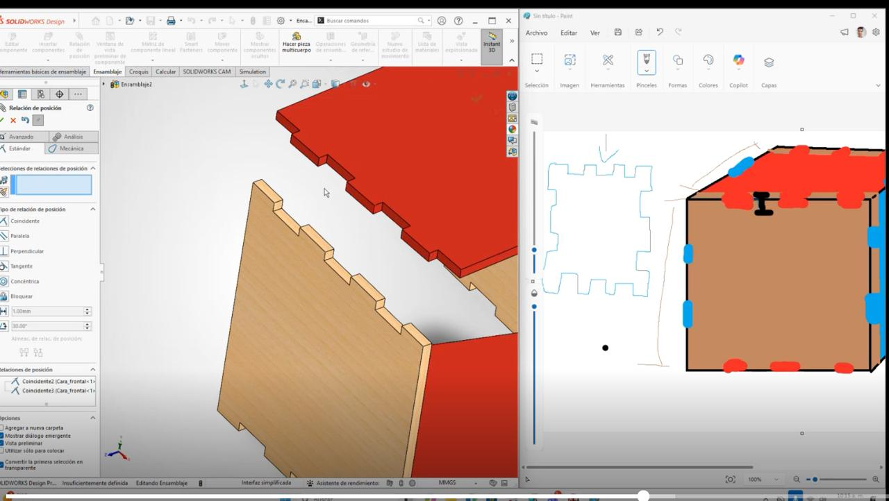
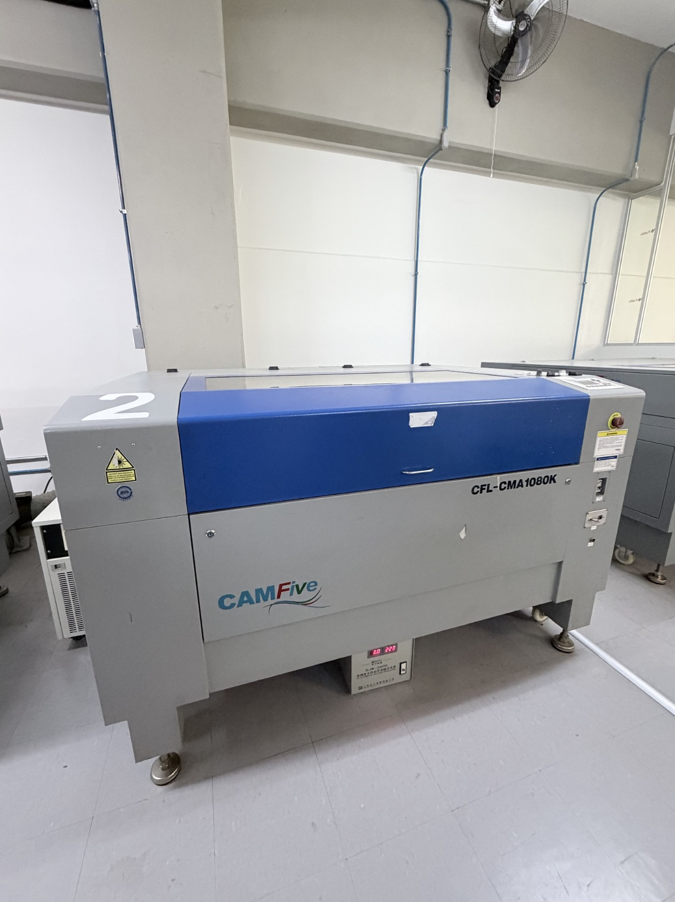

# Reporte de Clase 3 de Jesús Emiliano
**Institución:** Universidad Iberoamericana de Puebla
**Tema:** Modelado y Corte Laser

### 1.- Introducción de la Clase 3
El maestro Oliver nos mostró como diseñar una pieza para cortar y en otra sesión nos enseñó a usar la cortadora laser.

### 2.- Diseño de Corte Laser
La primera parte de un corte laser es diseñarlo en un programa de modelado 3D, en este caso usamos SolidWorks, después se diseñan las partes en 2D y se extruye el grosor del material que se utilizará, posteriormente se abre un ensamble y se comprueba que las piezas encajen de la manera deseada, una vez comprobado que nuestro ensamble haya quedado de la forma deseada el diseño se exporta en (.SLDDRW) para que finalmente las piezas se exporten en la tabla a imprimir.

### 3.- Uso de la cortadora Laser
Primero se prende la maquina mediante una fuente de energía que se encuentra debajo de la maquina y una vez encendida debe comprobarse que se haya prendido el refrigerador al costado que sirve para que la cortadora laser no se sobrecaliente.

Después se activa la maquina girando una perilla, apretando un botón y accionando una llave, posteriormente se selecciona el origen del cual se quiere partir, se ajusta la distancia del láser y del material el cual lo recomendable es el ancho de una USB.

Finalmente en el programa de la computadora se selecciona el programa de la impresora y se le asignan colores a los distintos cortes dependeidno de la acción deseada, ya sea gravado o corte.

