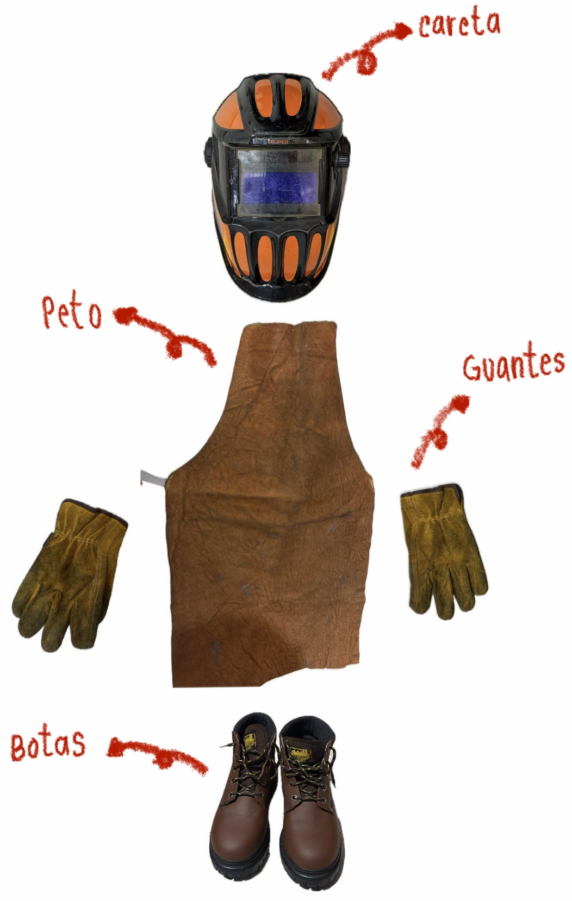
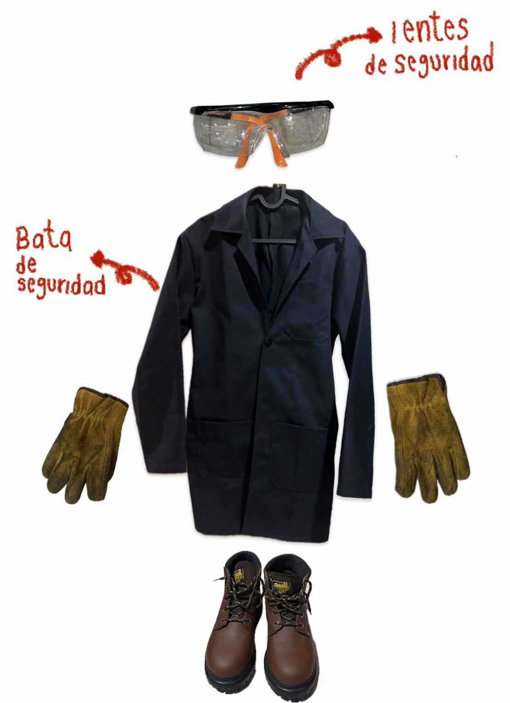
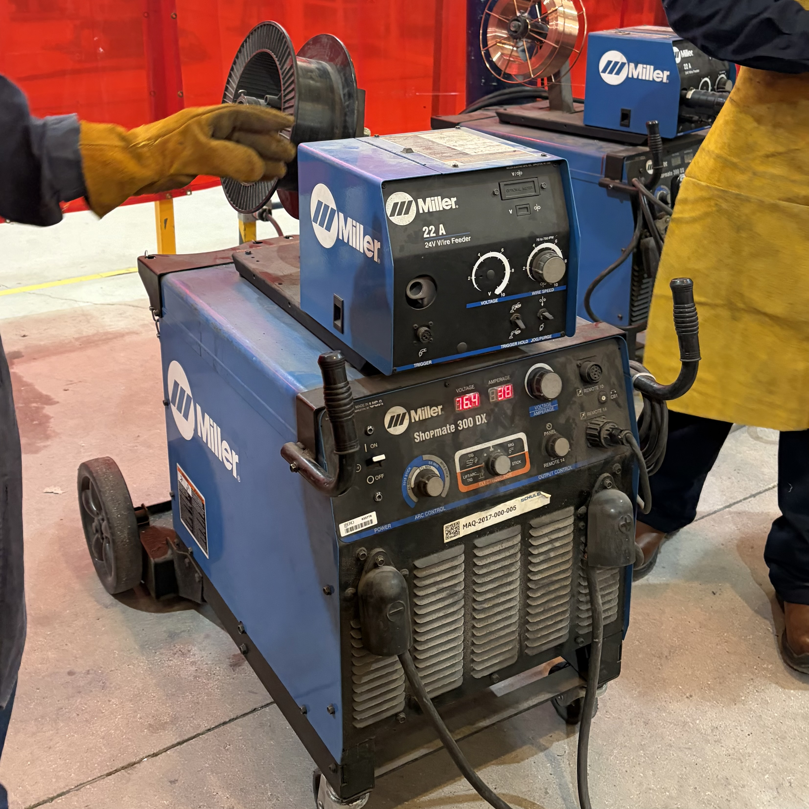
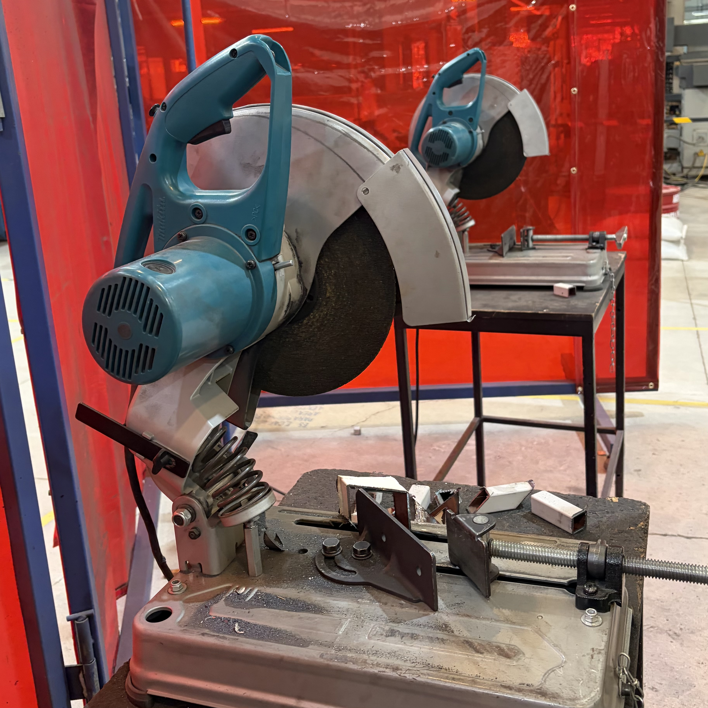
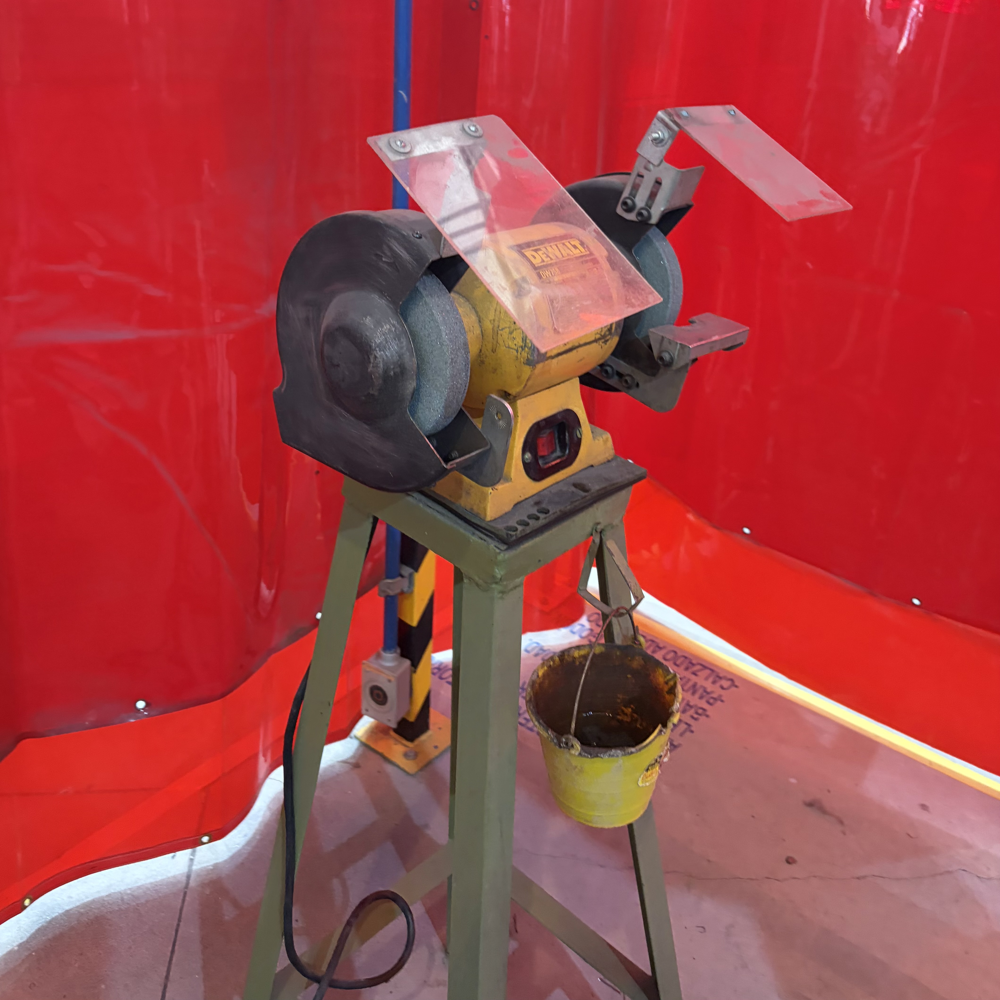
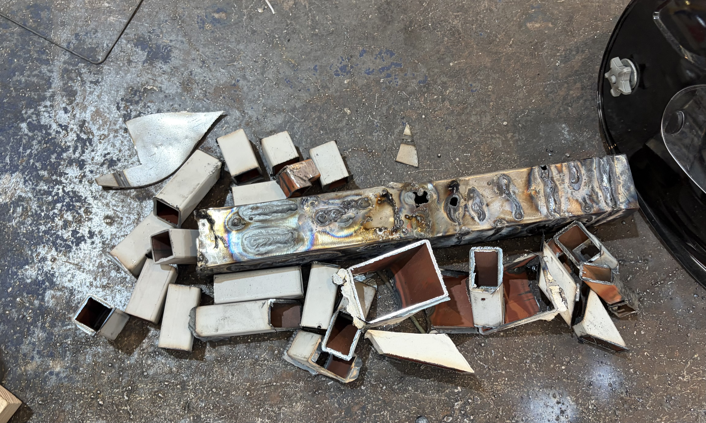
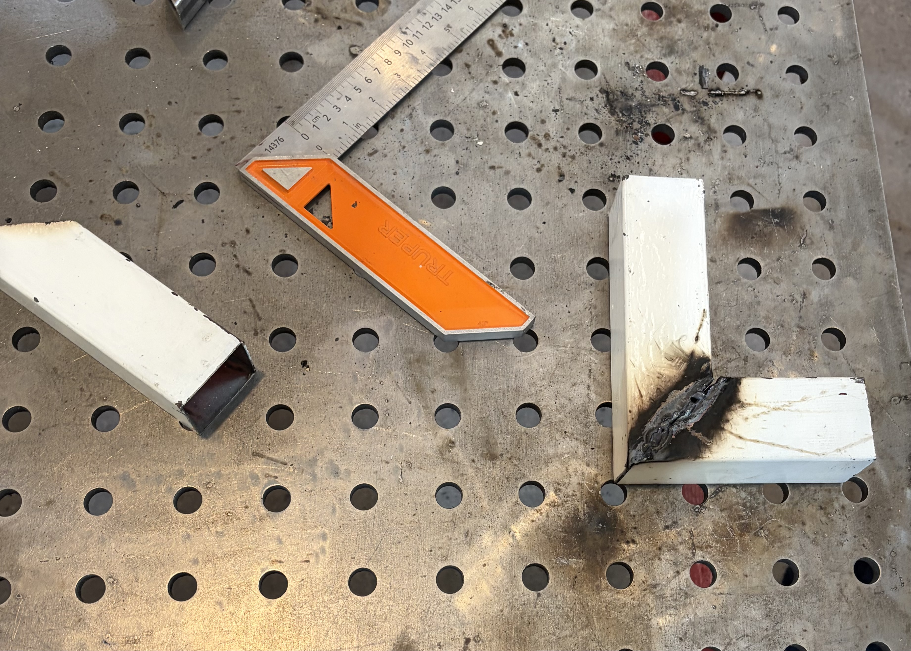

# **Conociendo los Procesos de Soldadura, Corte y Desbaste de Metales**
*28 de Agosto*

### **Equipo de Seguridad**
| Imagen | Descripción |
|---|---|
|  | Al momento de soldar es necesario utilizar el equipo correcto, ya que nos ayuda a reducir la posibilidad de sufrir una lesión al utilizar las máquinas.  • **Guantes para soldar:** Nos protegen de los elementos calientes y filosos.  • **Careta:** Protege la vista de la luz producida por la máquina de soldar.  • **Calzado de seguridad:** Cubre los pies de los objetos que puedan caer.  • **Peto:** Cubre el torso y la ropa de las partículas calientes y chispas que se generan al soldar. |
|  | • **Lentes de seguridad:** Protegen los ojos de las pequeñas partículas de metal y de las chispas que salen al cortar y desbastar.  • **Bata industrial:** Se utiliza para proteger la ropa y el cuerpo de pequeñas chispas. Además, ayuda a mantener la ropa cubierta mientras se utilizan las herramientas. |

### **Configuración y uso de la máquina de soldar**
| Imagen | Configuración |
|--------|-------------|
|  | Pasos para utilizar la máquina de forma segura y correcta.
1. **Conexión:** Conectar la máquin a a la corriente eléctrica posteriormente, la pinza de Tierra a la mesa metálica de trabajo y el portaelectrodo (varilla de soldadura), no debe tener contacto con la mesa.  
2. **Ajustar el voltaje y corriente:** Si se tiene un voltaje elevado, es más probable que se perfore la pieza, en cambio, si es bajo la varilla puede pegarse al material. Por ello, se recomienda calibrar el voltaje segun el material y el trabajo a realizar.  
3. **Técnica de soldado:** Utilizar un movimiento constante y despacio, sin pegar la varilla al material pero tampoco alejandola mucho. Recordando que si se avanza muy rápido la soldadura sera irregular y si es muy lento se puede realizar un hoyo. | 

!!! note "Nota"
    Asegurarse de que todas las personas porten careta al momento de soldar.

### **Uso de Cortadoras de metal**

| Imagen | Configuración |
|--------|-------------|
|  | Aprendimos a utilizar 2 tipos de cortadoras, en 90° y 45°. Ambas estan compuestas de un disco tipo lija, que desgasta el material hasta cortarlo; una prensa para asegurar que las piezas no salgan al momento de cortar. 
1. Se fija el material con la prensa que esta en la cortadora.
2. Se aprieta los dos botones (arriba y abajo) para que empiece a funcionar el disco.
3. Se realiza el corte en un movimiento continuo. |

!!! note "Nota"
    La cortadora consume más material, por ello, se debe dejar un margen para conseguir la medida necesaraio. Utilizar el equipo de protección ya que se deprenden chispas en todo el proceso.

### **Desbaste de piezas**
| Imagen | Configuración |
|--------|-------------|
|  | Después de realizar los cortes, se retiró el excendete con el esmeril.
1. Se acerca la pieza de forma horizontal, evitando ángulos
2. Busca emparejar los bordes. |

### **Conclusiones**

Al final de la clase, se cortaron piezas metálicas por medio de la cortadora, se desbastaron con el esmeril y finalmente se soldaron entre ellas para aplicar lo aprendido en la clase.
En conclusióntengo un mayor conocimiento sobre las máquinas, porque, a demás de conocerlas tuve la oportunidad de utilizarlas lo que que me familiarizo con su funcionamiento. Es una buena práctica porque es mejor aprender de la mano de un profesor que nos corrija, que por nuestra cuenta donde no vamos a saber cuando algo esta mal.

---
Tania Hernández Cruz