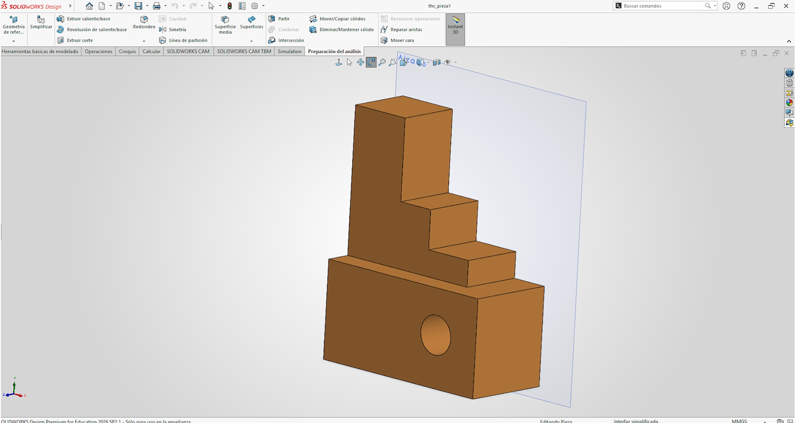
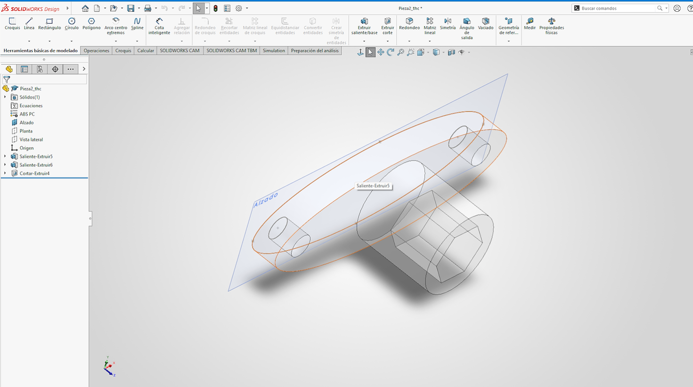

# **Introducción de la Materia y Diseño por computadora básica**
*21 de Agosto*

Como introducción a la materia, empezamos a utilizar solidworks. 
Una herramienta donde podemos realizar planos, croquis y piezas

| Imagen | Expplicación |
|--------|-------------|
|  | Esta fue la primera pieza que realizamos |
|  | Después me toco realizar esta pieza, donde mi mayor problema fue que no preste mucha atención a que medida se utilizaba. |

### **Pasos para realizarlos**
1. Abrir Solidworks
2. Seleccionar pieza
3. Abrir croquis
4. Realizar una cara de la figura.
5. Eztruir la figura

