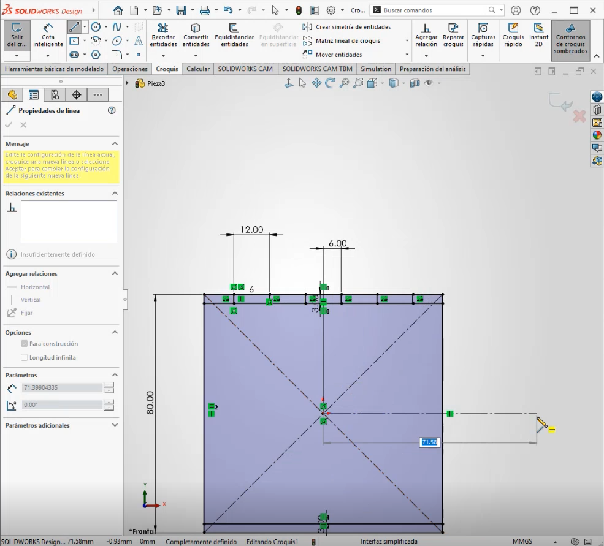
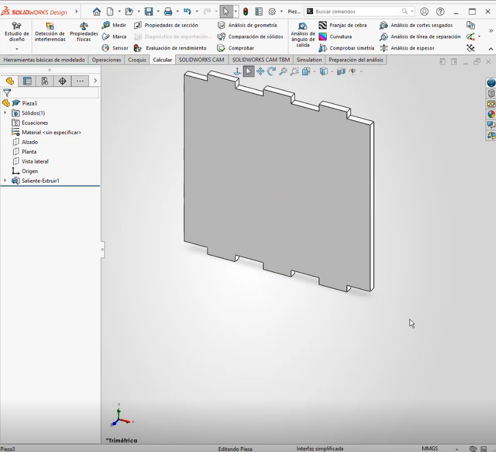
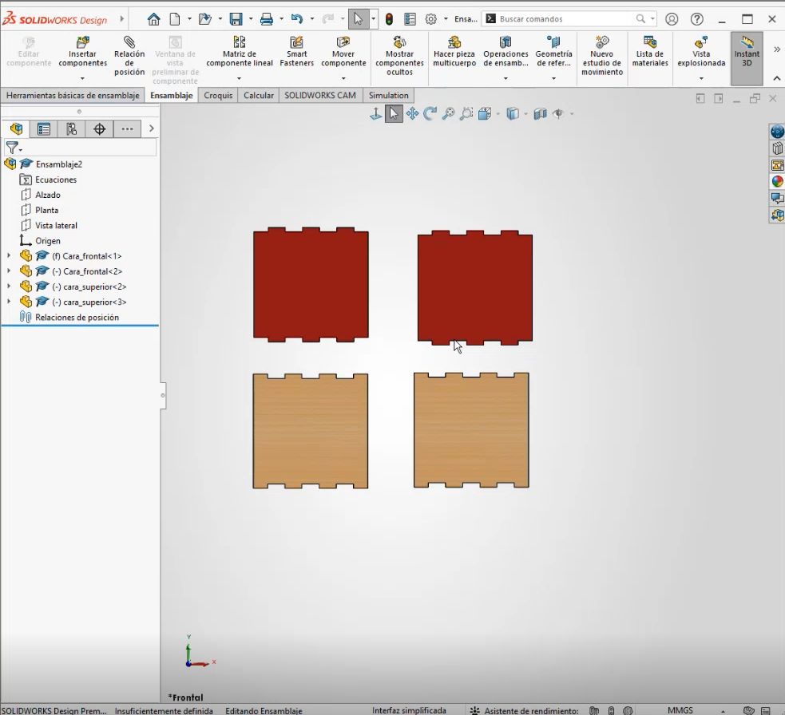
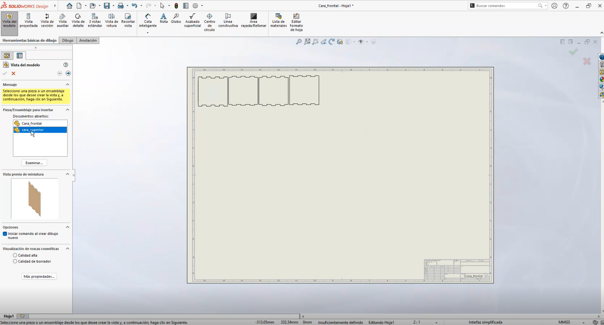
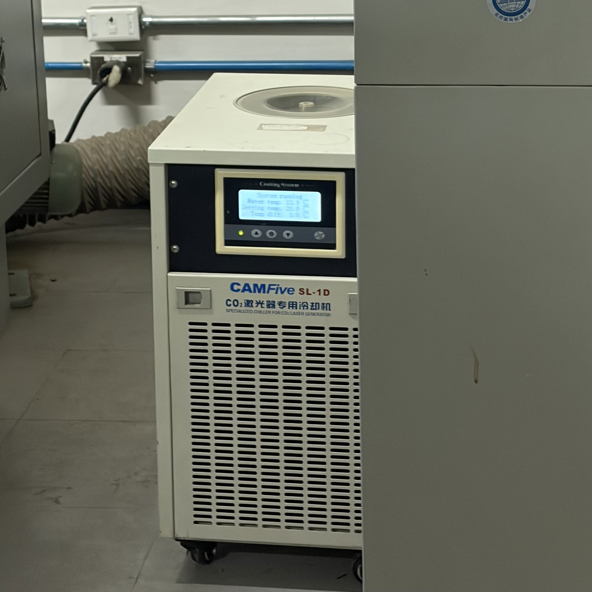
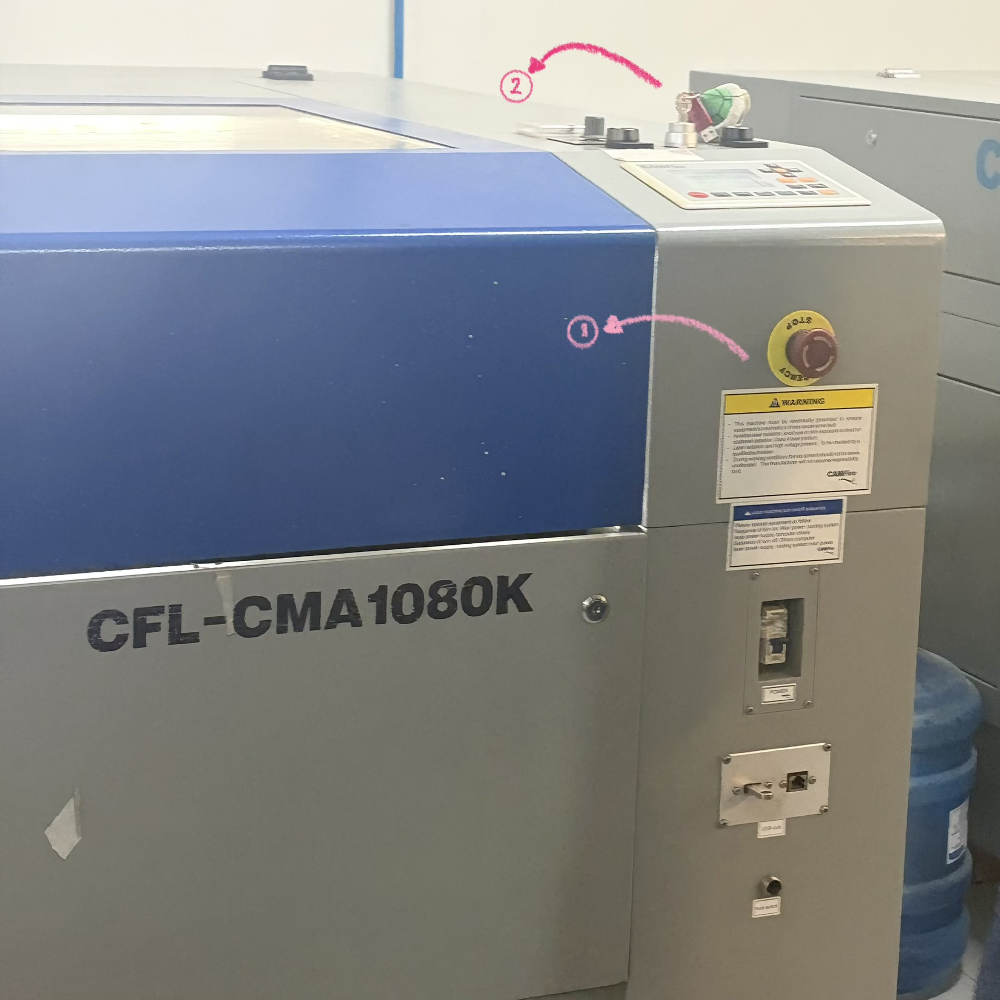
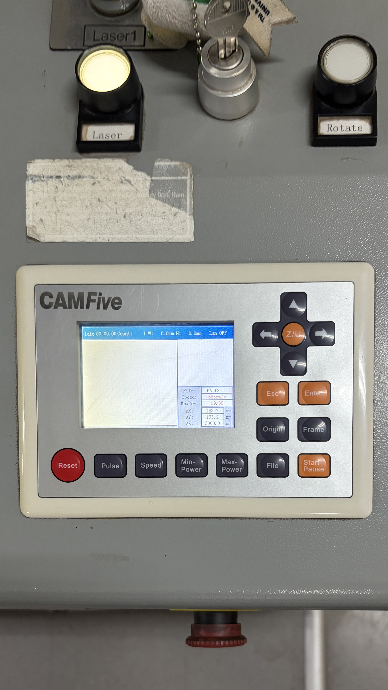
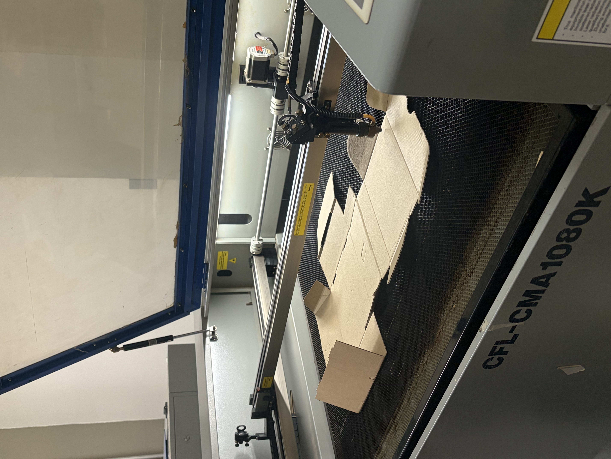

# **Máquina de Corte Láser: Funcionamiento**
*4 y 8 de Septiembre*
### **Modelado en Solidworks**
| Imagen | Expplicación |
|--------|-------------|
|  | 1. Empezamos haciendo el plano, en el croquis.Dibujando las piezas. |
|  | 2. Extruimos las piezas, utilizando el grosor del material que tenemos. |
| Después de realizar todas las puezas necesarias |
|  | 3. Abrimos la opción de ensamble donde podemos agregar todas las piezas que vamos a utilizar  |
|  |4. Ahí empezamos a acomodar las piezas para asegurarnos de que embonan . |
|  |4. Por último, agregamos las piezas para el corte. |

### **Pasos para utilizar la máquina**
| Imagen | Pasos |
|--------|-------------|
| " | 1. Encender el interrumptor con la mano |
| " | 2. Verificar que no aparezca ningun aviso o advertencia. |
| " | 3. Encender un switch que se encuentra del lado derecho de la máquina, después el boton de paro de emergencia y por último, insertar la llave proprocionada por el profesor y girarla.  Con esto la máquina ya esta lista para trabajar |
|  |4. Con las flechas definir el origen, esto asegura donde va a empezar la máquina el corte. |
|  | 5. Colocar el material, y dejar una distancia como de 1cm aproximadamente. |
